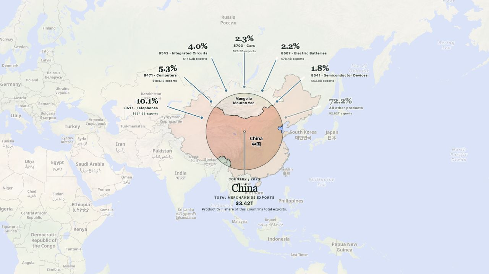

# Trade Atlas

[Trade Atlas](https://trade.lucasspeciale.com) is a static, interactive explorer for global merchandise trade. Drag the world map beneath a fixed country lens to inspect a country's HS4 export basket, or compare an HS2 category or HS4 product across countries.



## What it demonstrates

- A novel fixed-lens map interaction for exploring national export baskets
- Country, category, and product views built from one consistent trade model
- Product overlays for export share, dependence, net exports, and revealed comparative advantage
- Product-specific bilateral route views and shareable URL state
- A reproducible offline BACI pipeline with validation and demand-loaded static partitions
- Searchable countries and products with a year carousel covering 2017–2024
- A flat MapLibre map using OpenFreeMap's Liberty style and local country geometry

## Local development

Requires Node.js 20+ and pnpm 11.19.0.

```bash
pnpm install
pnpm dev
```

Open [http://localhost:3000](http://localhost:3000). Before handing off a change, run:

```bash
pnpm test
pnpm lint
pnpm build
```

The production build is a static export in `out/`.

## Architecture

The deployed app has no database or runtime trade-data API. `scripts/build_data.py` and DuckDB aggregate BACI locally into immutable JSON partitions under `public/data/trade/`. The browser loads annual HS2 data, compact HS4 country fingerprints, product overlays, and bilateral routes only as needed.

```text
Local BACI HS6 archive
        ↓ offline build
Validated HS2/HS4 JSON partitions
        ↓ static hosting
Next.js + React + MapLibre browser app
```

Raw BACI and boundary archives are ignored and must not be committed or deployed. The generated, browser-ready files in `public/data/trade/` are intentionally tracked so Cloudflare can build without the raw dataset.

Those deployable assets account for most of the repository. They are split into annual, product, country-lens, and route partitions so the browser loads only what the current interaction needs.

To rebuild the data, create `.venv`, install `requirements-data.txt`, add `data/raw/BACI_HS17_V202601.zip` and the boundary archive named in `data/raw/world-bank/README.md`, then run `pnpm data:build`. The report is written to ignored `data/processed/build-report.json`.

## Interpretation and limitations

- Net exports = exports minus imports.
- Export dependence = a product's share of a country's merchandise exports.
- World export share = a country's share of worldwide exports of that product.
- RCA compares a product's share of a country's exports with its share of world exports.
- Values are current US dollars; the build converts BACI's reported thousands of dollars to dollars.

The current [CEPII BACI HS17](https://www.cepii.fr/DATA_DOWNLOAD/baci/doc/baci_webpage.html) source covers 2017–2024, and 2024 is provisional. The app describes merchandise trade, not domestic production. `Other Asia, nes` is used as BACI's documented practical proxy for Taiwan; geographic presentation does not imply a political position.

Map geometry comes from [World Bank Official Boundaries](https://datacatalog.worldbank.org/search/dataset/0038272/world-bank-official-boundaries). The basemap is [OpenFreeMap](https://openfreemap.org/) using OpenMapTiles and OpenStreetMap data.

## Data and attribution

- Trade data: [CEPII BACI HS17](https://www.cepii.fr/DATA_DOWNLOAD/baci/doc/baci_webpage.html), distributed under France's Etalab Open Licence 2.0
- Product classification metadata: [Observatory of Economic Complexity](https://oec.world/)
- Boundary geometry: [World Bank Official Boundaries](https://datacatalog.worldbank.org/search/dataset/0038272/world-bank-official-boundaries)
- Supplemental Taiwan geometry: [Natural Earth](https://www.naturalearthdata.com/), public domain
- Basemap: [OpenFreeMap](https://openfreemap.org/) using OpenMapTiles and OpenStreetMap data

See [THIRD_PARTY_NOTICES.md](THIRD_PARTY_NOTICES.md) for the repository's attribution and licensing boundaries.

## Repository guide

```text
src/                     Application code and tests
scripts/build_data.py    Offline data build and validation
data/sql/                DuckDB aggregations
data/raw/                Local inputs and tracked metadata
public/data/trade/       Deployable generated data
.github/workflows/       Test, build, and Cloudflare deployment
AGENTS.md                Maintainer and agent instructions
future-projects.md       Trade Atlas roadmap and dataset ideas
```

## Deployment

Pushes to `main` run tests, lint, and the static build before deploying the Cloudflare Pages project `trade-atlas` to [trade.lucasspeciale.com](https://trade.lucasspeciale.com).

## Source availability

This repository is published as portfolio source, not as an open-source project. Original code and visual design are copyright Lucas Speciale and are provided under the terms in [LICENSE](LICENSE). Third-party data and dependencies retain their respective licenses.
